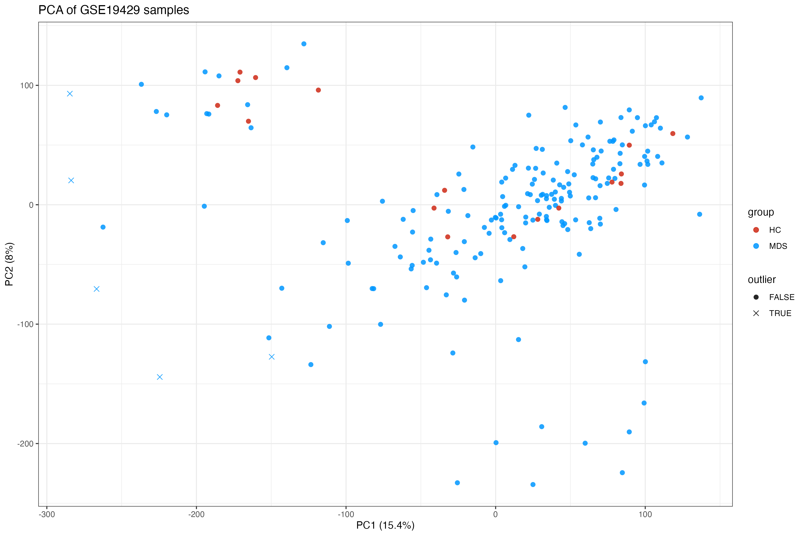
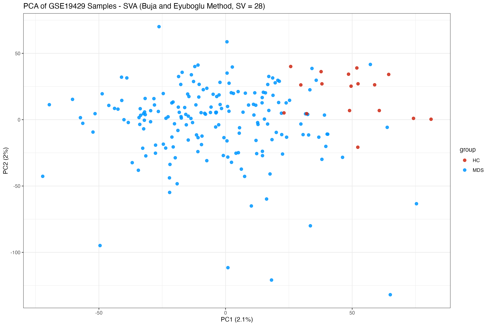
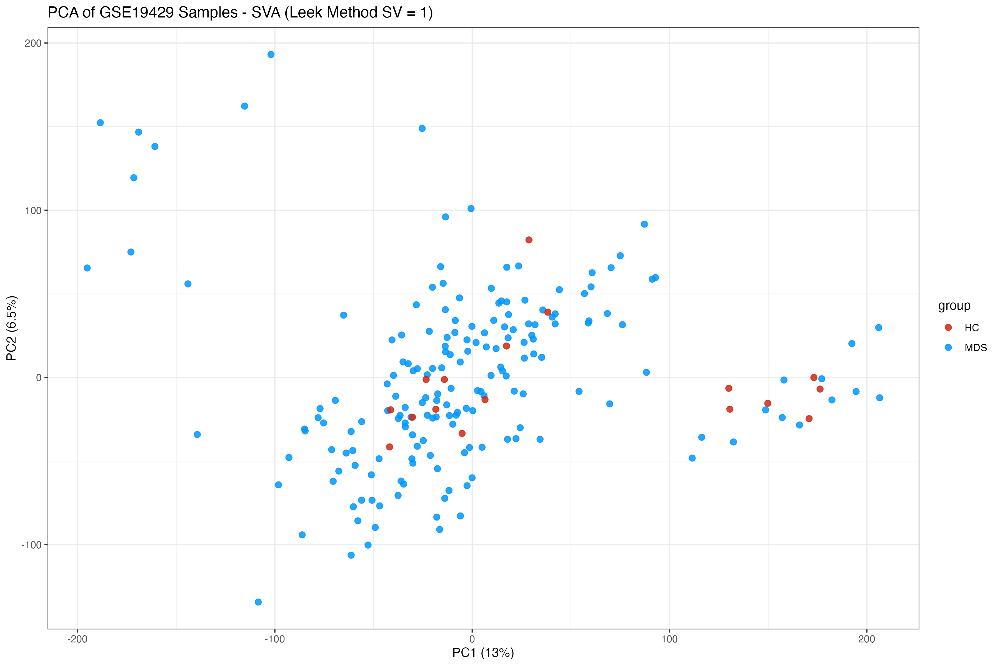
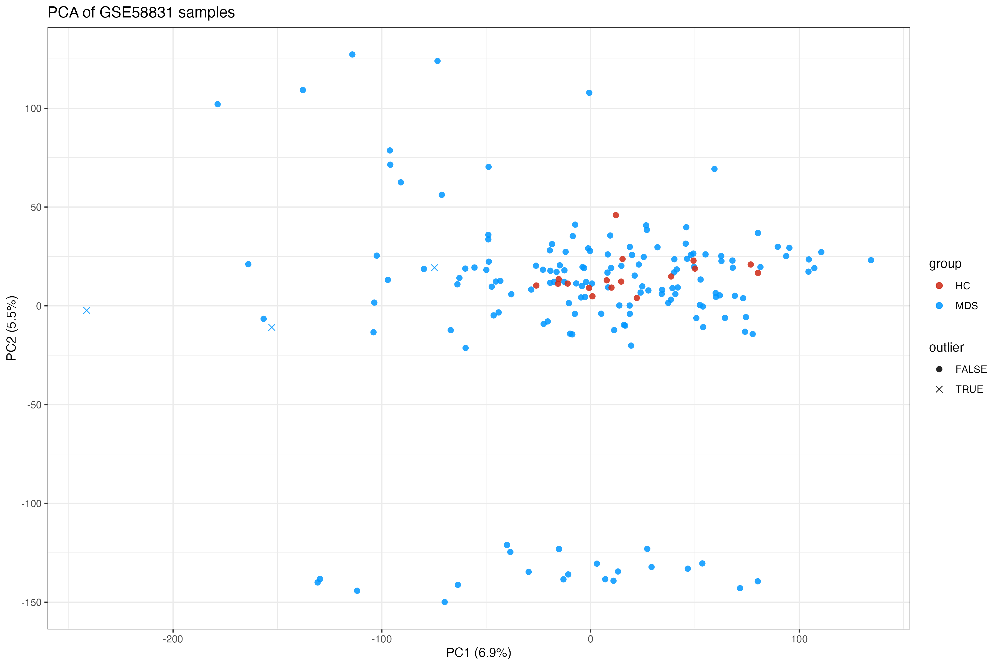
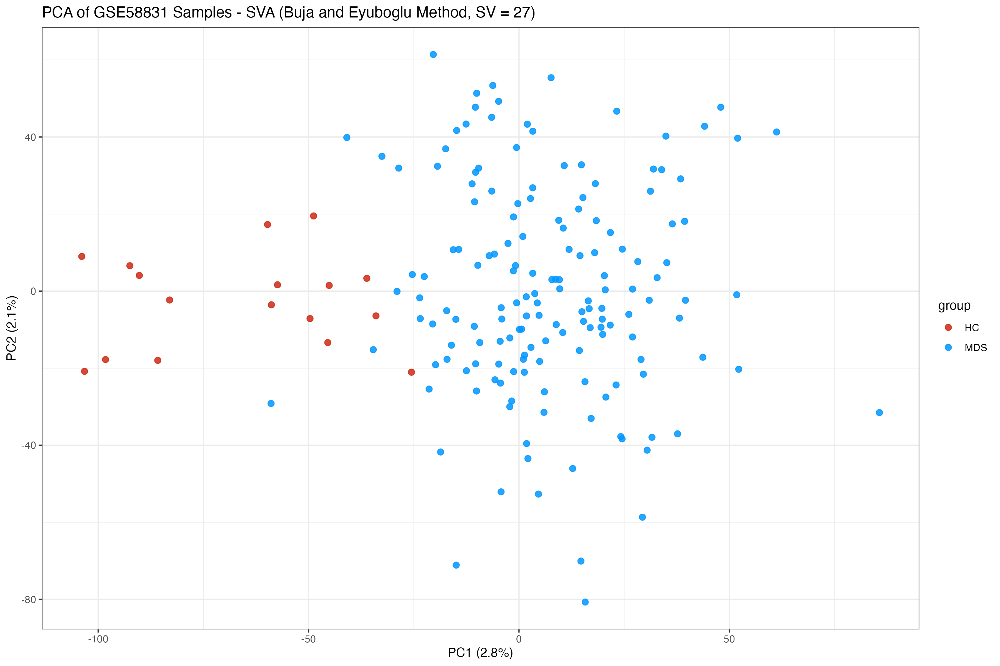
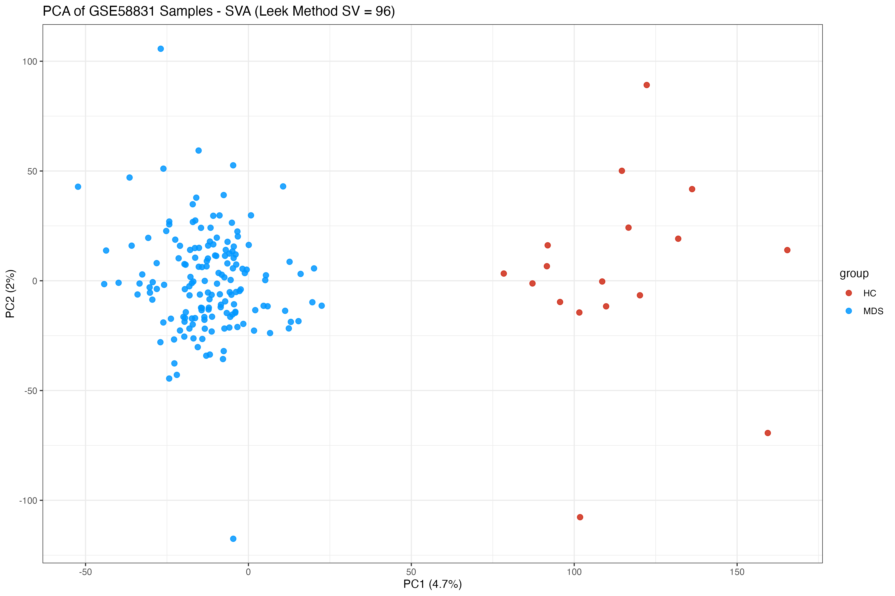
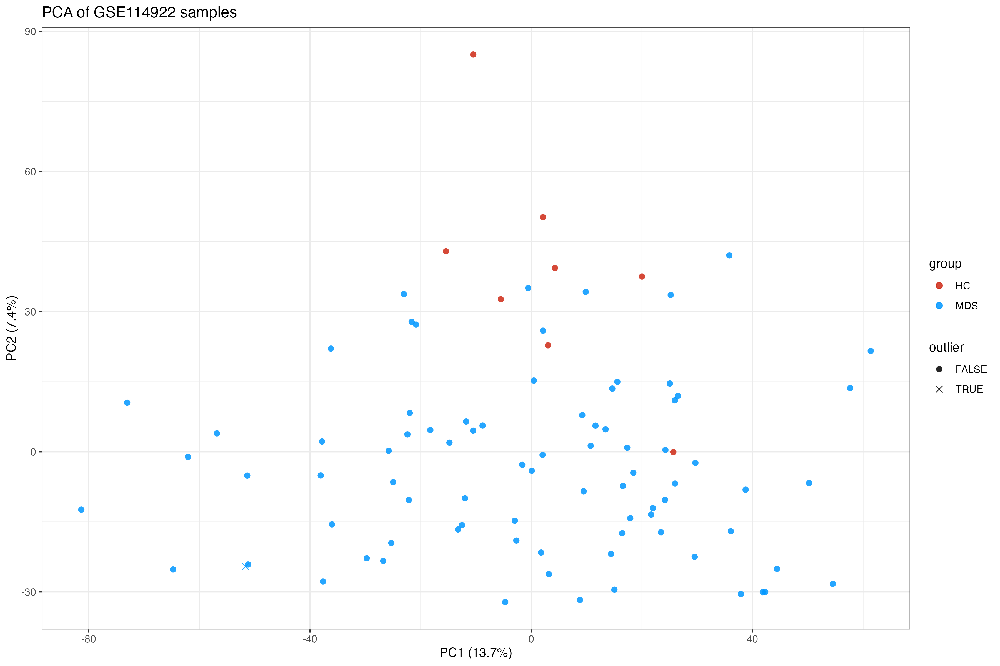
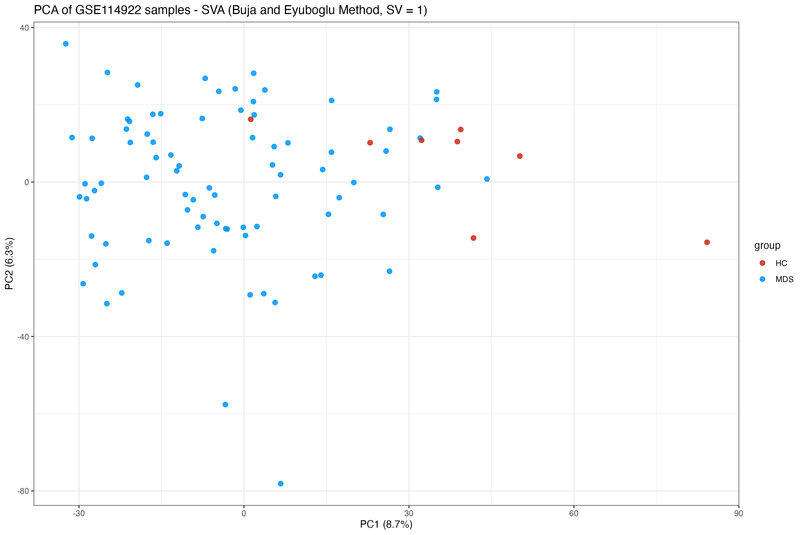
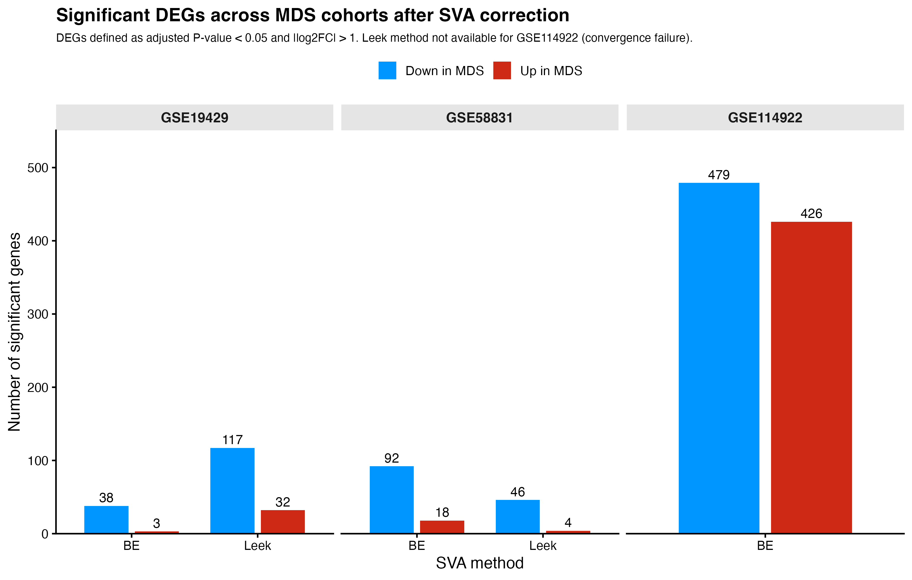

Surrogate Variable Analysis (SVA) Assessment Report: Diagnostic
Evaluation of Latent Batch Effects Across MDS Cohorts
================
Bioinformatics Analysis Service
2026-07-17

# 1. Executive Summary

This report documents the diagnostic assessment of latent, unmodeled
technical variation (batch effects) performed on three independent MDS
transcriptomic cohorts, using Surrogate Variable Analysis (SVA). The
objective was to evaluate whether incorporating surrogate variables into
the differential expression models would improve the biological validity
of the results, or whether it would introduce instability
disproportionate to its benefit.

Two independent estimation strategies were compared for each dataset:
the `be` (Buja-Eyuboglu) method and the `leek` method for surrogate
variable number estimation. Across all three cohorts, the two methods
did not converge on consistent or stable estimates, and applying
surrogate variable correction produced signs of overcorrection or
outright model failure rather than a clear improvement in signal
recovery.

Based on this diagnostic evidence, **SVA-derived surrogate variables
were not incorporated into any final differential expression model**.
This report presents the evidence supporting that decision in full,
together with its methodological limitations.

------------------------------------------------------------------------

# 2. Rationale and Objective

Public transcriptomic cohorts assembled from clinical samples are
frequently affected by unmodeled sources of technical variation (e.g.,
batch of processing, hybridization date, sequencing lane), which can
confound differential expression analysis if left unaddressed. SVA
provides a data-driven approach to estimate such latent sources of
variation directly from the expression matrix, without requiring prior
knowledge of the batch structure.

This assessment was performed as a **diagnostic step**, independent of
and prior to any decision to modify the final differential expression
models used in the main analysis (`Transcriptomic_analysis_report.md`).
The guiding question was: *does the estimated latent structure reflect
genuine technical variation that can be safely and stably removed,
without eroding the biological signal of interest?*

------------------------------------------------------------------------

# 3. Methodology

For each dataset, the following diagnostic procedure was applied:

1.  Estimation of the number of surrogate variables using two methods:
    - `be` (Buja-Eyuboglu permutation-based method)
    - `leek` (asymptotic method based on eigenvalue analysis)
2.  Construction of parallel SVA-adjusted objects (`_sva_be`,
    `_sva_leek` namespaces), keeping the baseline (unadjusted) object
    untouched.
3.  Comparison of the resulting number of estimated surrogate variables
    against sample size and residual degrees of freedom.
4.  Visual inspection of sample structure before and after correction
    via `removeBatchEffect()`, used strictly for visualization (PCA,
    heatmaps), never as direct input to differential expression testing.
5.  Comparison of the number of differentially expressed genes obtained
    with and without surrogate variable adjustment.

For microarray datasets, `sva()` was applied to log2-transformed,
normalized expression matrices. For the RNA-seq dataset, `svaseq()` was
applied to normalized counts.

------------------------------------------------------------------------

# 4. Dataset-Specific Diagnostic Results

## 4.1 GSE19429 (Microarray)

The `be` method estimated **28** surrogate variables and the `leek`
method estimated **1**. Correction using the `be` surrogate variables
resulted in a visible overcorrection: the proportion of variance
explained by the leading principal components collapsed to 2.1% (PC1)
and 2% (PC2), and the number of differentially expressed genes was
markedly reduced compared to the baseline model, consistent with removal
of biological signal rather than technical noise. No visible separation
between HC and MDS samples was recovered along either axis, and
case/control samples remained fully intermixed.

Under the `leek` correction (1 SV only), the leading components retained
substantially more variance (PC1 13%, PC2 6.5%), consistent with the
much lighter adjustment applied. Sample structure again showed no clear
HC/MDS separation, but the overall spread of points was wider and less
compressed than under the `be` correction, reflecting the more
conservative nature of this specific estimate for this dataset.

**PCA before SVA correction**

``` r
knitr::include_graphics(file.path("../results/GSE19429_microarray/EDA/03_pca_plot.png"))
```



**PCA after SVA correction (`be`)**

``` r
knitr::include_graphics(file.path("../results_sva/GSE19429_microarray/pca_plot_SVA_be.png"))
```



**PCA after SVA correction (`leek`)**

``` r
knitr::include_graphics(file.path("../results_sva/GSE19429_microarray/pca_plot_SVA_leek.png"))
```



## 4.2 GSE58831 (Microarray)

The two estimation methods diverged sharply for this cohort as well, but
in a pattern different from GSE19429: the `be` method estimated **27**
surrogate variables — comparable to GSE19429 — while the `leek` method
estimated **96**, a strikingly high number relative to the 176 total
samples in this cohort.

Under the `be` correction, the leading components explained a similarly
small fraction of total variance as observed for GSE19429 (PC1 2.8%, PC2
2.1%). Despite this low explained variance, healthy control samples
formed a visibly distinct group at strongly negative PC1 values,
separated from the more dispersed MDS sample cloud — a partial
separation that was not observed under `be` correction in GSE19429.

Under the `leek` correction (96 SVs), HC and MDS samples formed two
essentially non-overlapping clusters along PC1. While this might appear
to indicate an improved recovery of the case/control signal, a
correction that removes 96 surrogate variables from a dataset of 176
samples consumes a very large share of the residual degrees of freedom —
a similar structural concern to the one that caused outright model
failure in GSE114922 (Section 4.3). Such a clean separation obtained
after an extreme reduction in residual degrees of freedom should be
interpreted with caution, since it can reflect overfitting to
sample-specific variation (potentially including the group label itself)
rather than a genuine improvement in the recovery of biological signal.

**PCA before SVA correction**

``` r
knitr::include_graphics(file.path("../results/GSE58831_microarray/EDA/03_pca_plot.png"))
```



**PCA after SVA correction (`be`)**

``` r
knitr::include_graphics(file.path("../results_sva/GSE58831_microarray/pca_plot_SVA_be.png"))
```



**PCA after SVA correction (`leek`)**

``` r
knitr::include_graphics(file.path("../results_sva/GSE58831_microarray/pca_plot_SVA_leek.png"))
```



## 4.3 GSE114922 (RNA-seq)

The `leek` method estimated a disproportionately large number of
surrogate variables (**88 SVs**) relative to the sample size (90
samples, only 8 healthy controls), leaving near-zero residual degrees of
freedom in the resulting model. This caused `svaseq()` to fail during
density estimation, preventing the surrogate-adjusted model from being
fit at all. This result was interpreted as a clear indication that the
`leek` estimation procedure was unstable for this dataset, likely driven
by the extreme case-control imbalance.

The `be` method, in contrast, estimated only **1** surrogate variable
for this dataset — the lightest correction observed across all three
cohorts under either method. The resulting PCA (PC1 8.7%, PC2 6.3%)
showed a moderate tendency for healthy controls to cluster toward
positive PC1 values, but with substantial overlap with MDS samples,
consistent with a mild, non-disruptive adjustment rather than a
meaningful recovery of case/control structure.

Taken together, the three cohorts show no consistent relationship
between the two estimation methods: `be` was the aggressive method for
GSE19429 and GSE58831 but the conservative one for GSE114922, while
`leek` was conservative for GSE19429 but extreme (and destabilizing) for
GSE58831 and GSE114922. This absence of a consistent pattern — rather
than a fixed bias of one method — is itself informative, and is treated
as further evidence of instability in Section 7.

**PCA before SVA correction**

``` r
knitr::include_graphics(file.path("../results/GSE114922_rnaseq/EDA/03_pca_plot.png"))
```



**PCA after SVA correction (`be`)**

``` r
knitr::include_graphics(file.path("../results_sva/GSE114922_rnaseq/pca_plot_SVA_be.png"))
```



### Summary of estimated surrogate variables

| Dataset | `be` (n SV) | `leek` (n SV) | Outcome |
|----|---:|---:|----|
| GSE19429 | 28 | 1 | `be`: overcorrection, PCA variance collapse, DEG reduction. `leek`: mild adjustment, no group separation recovered. |
| GSE58831 | 27 | 96 | `be`: low variance explained, partial HC/MDS separation. `leek`: extreme SV count relative to sample size, apparent full separation likely confounded by degrees-of-freedom depletion. |
| GSE114922 | 1 | 88 | `be`: mild adjustment, moderate/overlapping HC trend. `leek`: model fit failure (near-zero residual degrees of freedom). |

# 5. Impact on Differential Expression: Baseline vs. SVA-Adjusted Models

To quantify the practical impact of each correction strategy, the number
of differentially expressed genes obtained under the baseline
(unadjusted) model was compared against the models adjusted using the
`be` and `leek` surrogate variables, for each dataset.

``` r
knitr::include_graphics(file.path("../results_sva/cross_dataset_deg_summary_sva_bar.png"))
```



------------------------------------------------------------------------

# 6. Cross-Cohort Replication as Indirect Supporting Evidence

As an indirect line of support for retaining the unadjusted models, the
degree of biological replication observed across the three independent
cohorts — generated on different platforms, in different laboratories,
and at different times — was evaluated (see
`Transcriptomic_analysis_report.md`, Section 8, for full cross-dataset
correlation and enrichment concordance results). The consistency of the
transcriptional signature across cohorts, despite the absence of
explicit batch correction, was taken as evidence that the baseline
models are dominated by reproducible biological signal rather than by
uncontrolled technical variation.

This argument is presented explicitly as a **qualitative, indirect**
line of support, and not as a formal quantitative diagnostic of residual
batch effect magnitude within any single dataset.

------------------------------------------------------------------------

# 7. Decision and Rationale

Based on the diagnostic evidence collected:

- surrogate variable estimates were unstable and method-dependent across
  all three cohorts (`be` vs `leek` disagreement), with neither method
  behaving consistently more conservatively or more aggressively across
  datasets (Section 4.3, summary table)
- the `leek` method failed outright for GSE114922 due to an implausibly
  high number of estimated surrogate variables relative to sample size,
  and produced a comparably extreme estimate for GSE58831 (96 SVs),
  raising equivalent degrees-of-freedom concerns even where the model
  did not fail outright
- the `be` method produced clear signs of overcorrection for GSE19429
  and GSE58831, including collapse of PCA variance structure and a
  marked reduction in DEG count

**SVA-adjusted surrogate variables were not incorporated into any final
differential expression model.** `removeBatchEffect()` outputs were used
exclusively for visualization (PCA, heatmaps), never as input to
statistical testing. All baseline (unadjusted) differential expression
results presented in `Transcriptomic_analysis_report.md` are the
definitive results of this project.

------------------------------------------------------------------------

# 8. Reproducibility

Software environment:

- R version: 4.6.0
- sva: 3.60.0
- limma: 3.68.4
- DESeq2: 1.52.0

Random seed fixed via `set.seed(1234)` for all stochastic steps. A
complete session information log is stored in the `results_sva/logs/`
directory of the project repository.

------------------------------------------------------------------------

# 9. Limitations and Considerations

- This assessment relies on two specific surrogate variable number
  estimation methods (`be`, `leek`); other approaches (e.g.,
  permutation-based alternatives, or fixing a fixed, small number of
  surrogate variables a priori) were not explored and could yield more
  stable behavior.
- The extreme case-control imbalance in GSE114922 (8 vs 82 samples) is a
  plausible structural driver of the `leek` method failure and limits
  the generalizability of this specific finding to more balanced
  datasets. The comparably extreme `leek` estimate obtained for the more
  balanced GSE58831 cohort (17 vs 159 samples) suggests, however, that
  sample size imbalance alone does not fully explain the instability of
  this method.
- The use of cross-cohort replication as indirect support for the “no
  correction” decision does not replace a formal, quantitative benchmark
  of batch effect magnitude; a dedicated before/after comparison (e.g.,
  DEG overlap quantification via Venn diagram between baseline and
  SVA-adjusted models) is identified as a natural future extension of
  this assessment.

------------------------------------------------------------------------

# 10. Conclusion

Diagnostic evaluation of Surrogate Variable Analysis across three
independent MDS cohorts revealed substantial instability in surrogate
variable estimation, with clear signs of overcorrection or model failure
depending on the method used, and no consistent pattern in which method
behaved more conservatively across datasets. Consequently, surrogate
variable adjustment was not incorporated into the final differential
expression models. The consistency of the transcriptional signature
observed across independent cohorts, in the absence of explicit batch
correction, supports the biological validity of the baseline models,
while the limitations of this indirect argument are explicitly
acknowledged.
